# VQA

### 一、问题描述：

给定一张图片和一个与图片相关的问题，要求生成问题的答案。

### 二、数据集

VQA 1.0
VQA 2.0
Visual Genome
Visual7W
COCO-QA

### 三、评价指标

通常每个image-question pair都由若干个不同的注释员给出自己的回答，以VQA数据集为例，每个pair都有10个人工给出的答案。VQA通常视作一个分类问题或文本生成问题，相应的评价指标有所不同：

##### 1.分类问题：
模型要在n种可能的回答中选择一个。常用的评判标准是准确率accuracy：
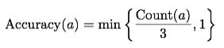

其中，a是模型给出的答案，Count(a)表示答案a在一个pair的所有人工答案中出现的次数。如果Count(a)超过3，就认为答案a是完全正确的。

##### 2.文本生成问题
模型要提取出图像和问题的特征，把特征输入一个语言生成模型（比如RNN），输出一个任意长度的句子作为答案。（to-do）

### 四、方法概述

VQA问题要求模型能够理解图像和问题（文本）的语义，将这两种语义恰当地结合起来，然后预测答案。因此，VQA模型通常采用的结构如下图所示：
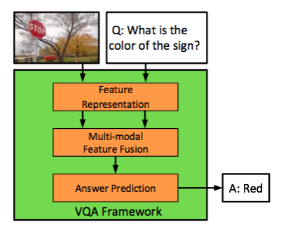

模型可以分为以下三个部分：
#### 1.从图像和问题中提取特征
（1）图像特征：低级（区域）特征（top-down，bottom-up），高级（语义）特征
（2）文本特征：RNN,BRNN,多层次（单词/短语/句子）特征
（3）注意力模型
#### 2.多模态特征融合
单线性：连接、相加、点乘
双线性：MCB, MLB, MFB, MUTAN
#### 3.预测答案
单分类：以most voted的答案作为label(交叉熵loss)/从所有答案中依概率随机sample一个答案作为label(交叉熵loss)
分布预测：所有人工标注的正确答案用一个概率分布表示，计算真实分布和预测分布之间的KL散度
语言生成：to-do

### 五、方法分类

#### （一）按照多模态特征融合的方法不同，可以分为：

* 单线性（点加、点乘、连接）
* 双线性：矩阵外积

最简单的双线性融合如下式：

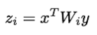

其中x是m维图像特征，y是n维文本向量，Wi是(m,n)维的矩阵。
存在的问题：参数量过大，难以训练，而且容易过拟合；直接计算外积，计算量太大。
几种改进算法：
* MLB
* MCB[6]
* MUTAN
* MFB[7]

#### （二）按照视觉特征的抽象层次不同

* CNN中间层特征（低级视觉特征）[1,2,3,4,5]
* CNN高层特征（高级语义特征）[1,3,13]

下图是近年来比较有代表性的一些工作。
第一部分：无visual attention
第二部分：有visual attention，无semantic feature
第三部分：有semantic feature
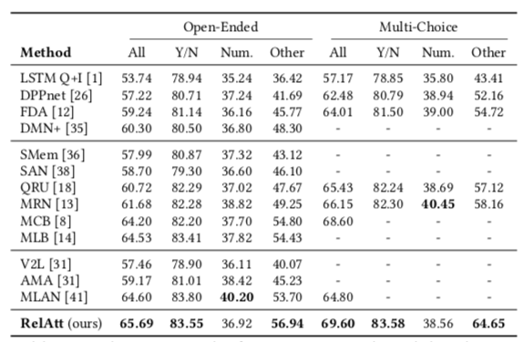

#### （三）按照注意力模型的不同

根据注意力模型中的查询对象和被查询对象不同，可以分为以下几种：

* 问题 -> 低级视觉特征（区域特征）（top-down attention）[1,2,3,4,5]
* 问题 -> 高级视觉特征（语义特征）[1]
* 低级视觉特征（区域特征）-> 问题[2]
* 低级视觉特征（区域特征）-> 高级视觉特征（语义特征）[3]
* 图像本身 -> 低级视觉特征（区域特征）（bottom-up attention）[4,5]
* 问题本身 -> 问题特征[2]

##### [1]Multi-level attention networks for visual question answering(MLAN, 2017cvpr)

* 基于文本的语义注意力：因为并不是图像的所有concept都和问题有关，所以需要用attention模型来侧重那些关系密切的concepts。本文用问题特征作为query，来计算concepts的注意力权重，得到attended semantic feature；
* 基于上下文的低级视觉特征：与之前的工作独立提取各图像区域的特征不同，这篇论文考虑了不同区域之间的交互，它用一个BRNN来编码图像的上下文环境，然后用BRNN的隐藏状态作为context-aware visual feature，取代原来的各区域独立的visual feature。

模型结构如下图所示：
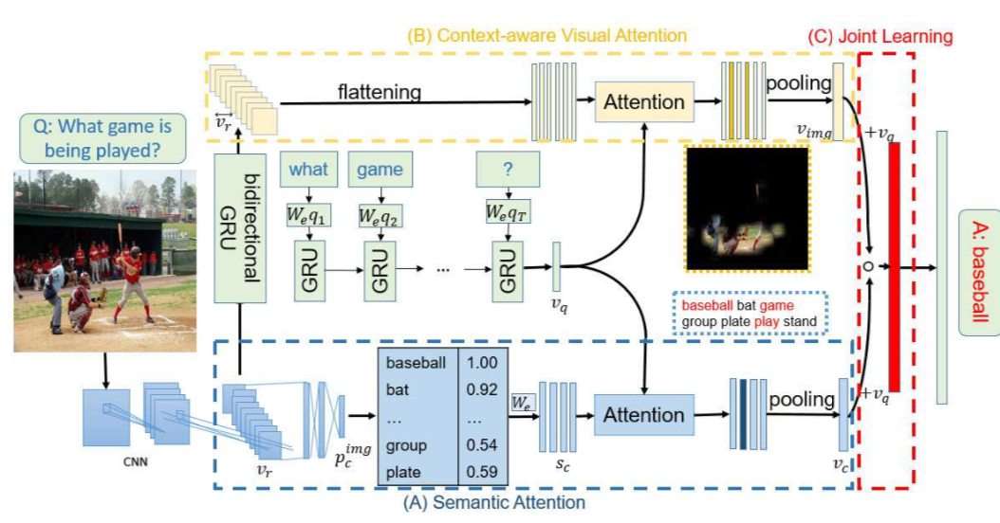

**1.semantic attention：**
首先，一个CNN从图像中提取特征，然后通过一个sigmoid层，输出每个concept在该图像中出现的概率（concept是从数据集中提取的出现频率最高的一些词汇，每个concept都用一个单词表示，concept与问题中的单词共享同一个词汇表和嵌入矩阵）。这部分称为concept detector，是在数据集上预训练好的。接下来，所有concept对应的one-hot向量，都经过词嵌入，再经过一个线性映射，变成与问题特征相同的维度。最后，两者作点乘，再和前面求出的concepts的概率分布相乘，得到attention weights，作pooling得到最终的semantic feature。

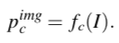
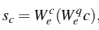
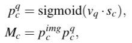
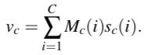

**2.context-aware visual feature：**
将每个区域的特征排成一列，依次输入BRNN，然后取每个时刻BRNN的两个隐藏状态相加，得到相应区域的context-aware visual feature（效果并不好，可能是RNN只能有效地提取序列信息，而不能提取具有2维结构的数据特征）。接下来用问题特征作为查询，求出attended visual feature。
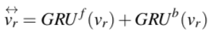
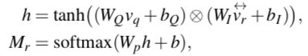
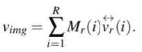

**3.joint learning：**
visual feature和semantic feature分别与question feature相加，然后作点乘，最后经过softmax层输出概率分布。

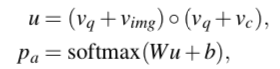

##### [2]Hierarchical Question-Image Co-Attention for Visual Question Answering

* 多层次文本特征：提取了问题的单词/短语/句子三个层次的特征。
* 文本-图像互注意力：不仅用文本特征来计算图像各区域的权重，也用图像特征来计算文本中各单词/短语/句子的权重；另外还提出两种计算互注意力的方式，一种是同步（平行）计算，一种是异步（轮流）计算。

**1.多层次文本特征：**
（1）单词：通过词嵌入获得每个单词的特征；
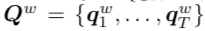

（2）短语：通过对单词特征作1维卷积（使用3个卷积核，长度分别为1，2，3），取得问题的一/二/三元短语特征，作max pooling得到最终的短语特征；
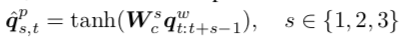
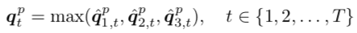

（3）句子：通过用LSTM对短语特征进行编码，得到每时刻句子级别的文本特征。

**2.文本-图像互注意力：**
两种计算方式的计算图对比如下所示：
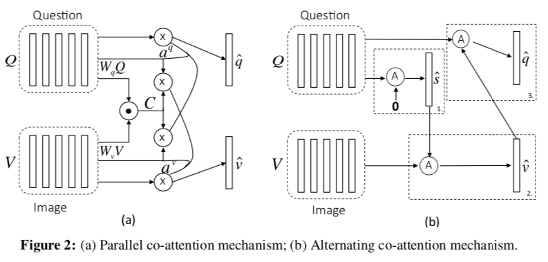
（1）平行计算：（公式的含义没有理解）

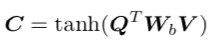
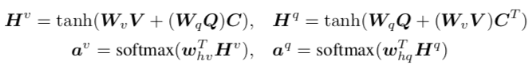
（2）轮流计算：
假设待计算注意力的特征集合为X，用于计算注意力的查询特征是g。那么计算注意力的流程可以用一下公式统一概括：
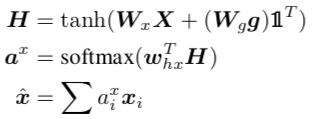
轮流计算文本和图像注意力的流程为：
X = Q, g = 0:相当于计算文本的自注意力，这一步获得attended question feature q；
X = V, g = q:基于文本的图像注意力，这一步获得attended visual feature v;
X = Q, g = v:基于图像的文本注意力，这一步获得final attended question feature q.

（3）推断：
由于文本特征有3个不同的level，这篇论文对每个level都分别计算了注意力。
推断的流程如以下公式所述：

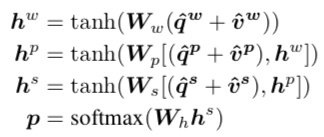

##### [3]R-VQA: Learning Visual Relation Facts with Semantic Attention for Visual Question Answering(RelAtt, 2018cvpr)

* 引入关系作为语义特征：不仅使用concepts和attributes作为图像的语义特征，还引入了主体之间的关系作为语义特征的补充。
* 用基于低级视觉特征的语义注意力替代基于文本的视觉注意力。

模型结构如下图所示：

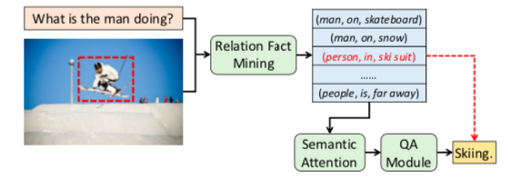

**1.relation fact detector：**
用于检测图像中与问题相关的relation fact，这是这篇论文的关键点。
（1）数据集
每个relation fact可以用一个三元组（subject，relation，object）来表示。在Visual Genome数据集中，对每个图片，除了标注有图片中的物体、图片的属性之外，还标有图片中主体之间的关系（relation fact）。不过，数据集中没有标注哪些关系是和特定问题最相关的。本文通过计算每个关系与（图像-问题）对的相似性，给每个（图像-问题）对都标注了与其最相关的关系，形成了一个扩展的数据集R-VQA。
（2）模型
接下来，就可以用监督学习的方式来训练relation fact detector了。具体地说，首先从问题中提取文本特征，再从图像中提取视觉特征，将两种特征作融合，然后通过三个线性分类器，分别输出每个subject，relation，object与（图像-问题）对相关的概率（由于数据集中的subject，relation，object数目有限，所以可以把relation fact detect视为一个分类问题）。其模型如下图所示：
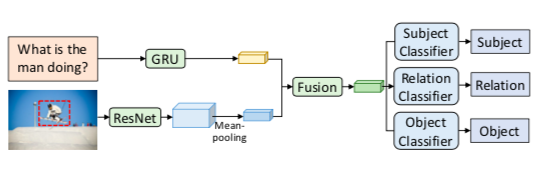
（3）检测
假设每个relation fact出现的概率是它的三个元素出现概率之和，那么给定三个元素各自的概率分布，可以求出前k个最相关的relation fact，每个都由3个one-hot向量构成，首先把它们嵌入到共同特征空间中，然后备用。

**2.semantic attention：**
首先用GRU提取问题的文本特征，然后用ResNet提取图像的区域特征，两者作MLB融合，经过softmax层输出attention map，得到attended visual feature。再用它和1中得到的relation facts作MLB融合，经过softmax得到attention weights，最后计算attended relation fact，将其作为最终的semantic feature。

##### [4]Tips and Tricks for Visual Question Answering

##### [5]Bottom-Up and Top-Down Attention for Image Captioning and Visual Question Answering

##### [6]MCB:Multimodal Compact Bilinear Pooling
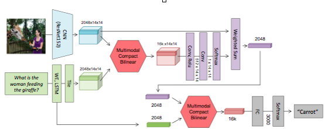
（1）count sketch算法：总之是一种把n维向量映射为d维向量的算法。它的性质是：两个向量外积的count sketch，等于两个向量count sketch的卷积。
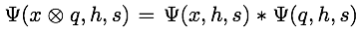

（2）MCB流程：v（2048）和q（2048）都经过count sketch转换为16k维向量v’和q’。然后v’和q’分别作傅里叶变换，点乘后作逆变换，得到v和q外积的count sketch。
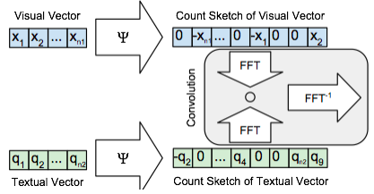

##### [7]MFB:Multimodal Factorized Bilinear Pooling
MFB借助了矩阵分解的思想来解决双线性运算参数量大的问题。矩阵W可以视为两个低阶矩阵U和V的乘积：

$$W_{m,n} = U_{m,k} * V_{k,n}$$

$$z_{i} = x^{T}U_{i}V_{i}^{T}y = (x^{T}U_{i})(y^{T}V_{i})$$

其中k远小于m和n。计算图如下所示：

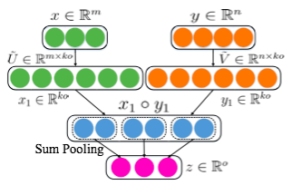

##### [8]Generating Visual Explanations

这篇论文研究可解释图像分类问题。具体地说，它要生成一个自然语言句子，用来解释图像分类模型将一张图片分为特定类别的原因。

没太看懂。有几个明显的问题：
1.相关度损失与辨识度损失存在一定的冲突：
如果模型生成的对一张图片分类结果的解释有很高的辨识度，那么它很可能和这张图片的描述很不一致，因为它可能略去了一些在描述中出现而和分类结果无关的部分，同时又加入了一些非常细微的、在描述中没有出现的部分。
2.辨识度损失的设计不够合理：
作者用图片的描述和类别标记作为训练数据，训练一个LSTM分类器，输出一张图片的描述，输出图片的类别。如果把它输出的概率作为奖励函数，那么存在的问题是：生
成的解释越接近图片的描述越好，但设计辨识度损失的本来目的，是要让生成的解释具有类别辨识度，而不要和图片的描述完全一致，这是自相矛盾的。

* 将图像特征与类别信息融合起来，通过LSTM生成自然语言解释
* 用相关度损失和辨识度损失来训练模型，使生成的解释1.与图像相关（一致性）；2.有辨识度（能够解释做出指定分类决策的理由）

模型结构如下图所示：
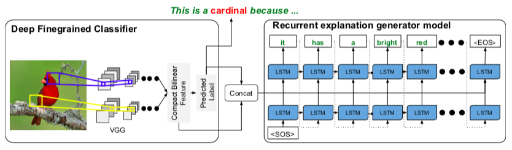

模型的两个损失函数：
1.相关度损失：
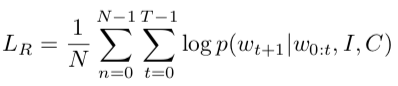
2.辨识度损失：
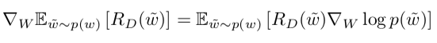
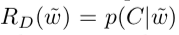

模型的训练过程如下图所示:
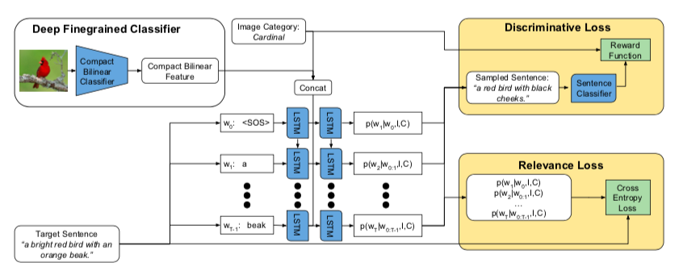

##### [9]Generating Natural Language Explanations for Visual Question Answering Using Scene Graphs and Visual Attention

这篇论文同样可解释VQA的问题。与以往的研究直接使用人工标注的解释来进行训练相比，这篇论文不需要完整的人工解释，只需要一些人工标注的片段信息，比如图片中各区域的描述，以及实体与实体间的关系。这些在现有的VQA数据集中是可获取的。

首先采用最简单的VQA模型来预测答案（ResNet提取低级视觉特征，LSTM提取文本特征，使用基于文本的视觉注意力机制，生成一张attention map，将pooling之后的视觉特征与文本特征作连接，经过一个线性分类器输出答案）。接下来，根据问题Q、答案A以及attention map，生成答案的解释。

模型如下图所示：
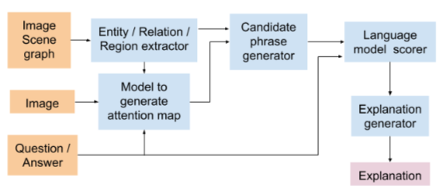

1.Entity/Relation/Region extractor：
从图片中提取实体、关系、区域描述等信息，用作生成解释的原料。这些信息可能是数据集中自带的，也可能需要用一个模型来提取。

2.Model to generate attention map：
即注意力模型，它根据文本特征，生成一张attention map。

3.Candidate phrase generator and language model scorer:
为了选择与问题和答案相关的区域描述/实体/关系，需要衡量这些信息与问题和答案之间的相关度：
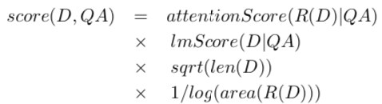

其中D表示一个区域的描述，R(D)是它所对应的区域，相关度与两个因素有关：attentionScore - R(D)与attention map中的热点区域交集越大，表明它越可能与答案相关（为了抵消区域之间大小不一致造成的不公平，后面又除了区域面积的对数）；lmScore - 衡量在一个预训练的语言模型中，给定上文Q和A，下文出现D的概率（为了抵消对长句的不公平，后面又乘了句子长度的平方根）。

4.Explanation generator:
计算完相关度之后，接下来就生成最终的解释。分两种情况讨论：
（1）有区域描述：这时就按照相关度，输出最相关的几条描述作为解释。
（2）有实体/关系：这时首先按照实体与它们之间的关系，建立一张scene graph，以实体作为图的顶点，以实体间的关系作为图的边。接下来，用深度优先搜索的方法（这里没看懂是什么操作），获得最终的解释。

##### [10]Multimodal Explanations: Justifying Decisions and Pointing to the Evidence

这篇论文同样研究可解释VQA问题，主要贡献如下:

* 视觉解释：根据答案，生成一张图像的attention map，用来指示图像中支持此答案的区域；
* 文字解释：将问题、图像、答案三方面的特征融合后，用来生成解释
* 监督学习：作者收集了一个VQA-X数据集，其中包含人工标注的每个图片-问题对的答案、视觉解释和文字解释，利用这个数据集，通过监督学习训练模型

模型结构如下图所示：
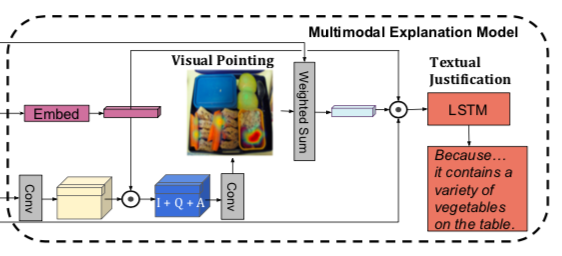

##### [11]VQA-E: Explaining, Elaborating, and Enhancing Your Answers for Visual Questions

这篇论文同样研究可解释VQA问题，主要贡献如下:

* 采用迁移学习的方法，同时训练答案预测模型和解释生成模型，使两者的表现都有所提升
* 作者用自动化的方法收集了一个VQA-E数据集

1.迁移学习：
模型结构如下所示：
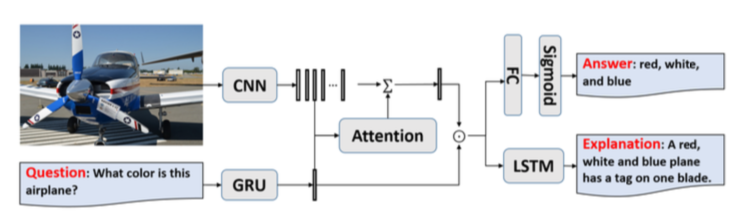

2.数据集VQA-E：
为了VQA数据集中的每个IQA triplelet生成相应的ground truth explanation，作者借助于图像的描述。具体地，对每个IQA triplelet，作者首先找到与图像I最相近的描述C，相似度的计算如下所示：
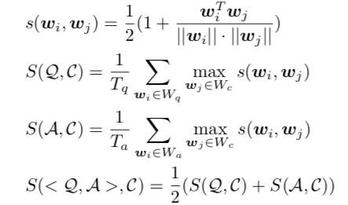
其中的w表示词嵌入向量。
接下来，对每个IQAC四元组，作者首先将Q和A合并为一个陈述性语句S，然后获取S和C的语法树，找到其中相同的节点，最后用S中以该节点的父节点为根的子树替换C中以该节点的父节点为根的子树，就得到解释E的语法树。
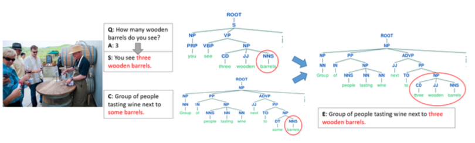

##### [12]Using Explanations to Improve Ensembling of Visual Question Answering Systems

（待看）主要是将现有的几个比较好的VQA模型作融合。

##### [13]Tell-and-Answer: Towards Explainable Visual Question Answering using Attributes and Captions

* 同样属于利用语义特征的line，但它提取的语义特征，除实体和属性之外，还有图像的描述（如此能够把握实体之间的关系）

模型结构如下所示：
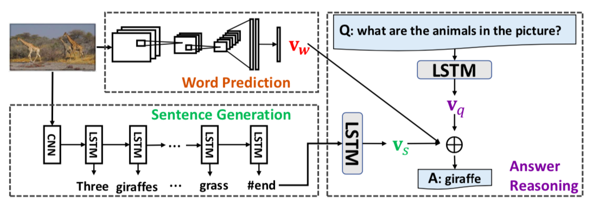

1.word-level semantic feature：多标签分类
2.sentence-level semantic feature：预训练的caption模型