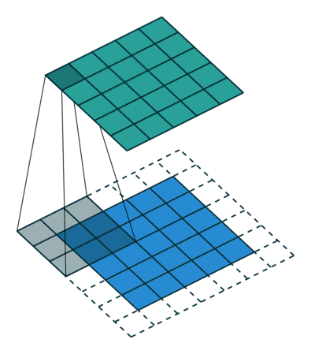

# 1. 简介
## 1.1. 卷积
**1.局部感受野**

**2.参数共享**

## 1.2. 为什么需要图卷积

**为什么不能直接使用卷积？**
* 每个节点的邻居数目不一定相同

**那么问题来了，如何定义不规则图结构上的卷积呢？**

## 1.3. 图卷积直观理解
定义一：
$$
f\left(H^{(l)}, A\right)=\sigma\left(A H^{(l)} W^{(l)}\right)
$$
A是邻接矩阵
定义二:
$$
f\left(H^{(l)}, A\right)=\sigma\left(\hat{D}^{-\frac{1}{2}} \hat{A} \hat{D}^{-\frac{1}{2}} H^{(l)} W^{(l)}\right)
$$
1. **传递**信息给相邻节点

2. **接受**来自相邻节点的信息

3. 计算新的表示

**VS. cnn卷积**
cnn卷积也可以算是接受来自附近节点的信息，然后接受并更新，随着层数增加，感受野逐渐增加
## 1.4. 图卷积应用

图片和文本经过一定处理后也是一个不规则图结构，cnn卷积，lstm,transformer等网络无法处理
# 2. 图上的卷积定义
## 2.1. 基础

1. 傅里叶变换及其逆变换
$$
\mathcal{F}\{f\}(v)=\int_{\mathbb{R}} f(x) e^{-2 \pi i x \cdot v} d x 
$$
$$
\mathcal{F}^{-1}\{f\}(x)=\int_{\mathbb{R}} F(v) e^{2 \pi i x \cdot v} d v
$$

我们把函数看成是一个向量，上面的$e^{2 \pi i x v}(v\in R)$可以看成是一组正交基,那么傅里叶变换做的事就是求出原向量在各个正交基上的投影，傅里叶逆变换自然就是各个正交基加权求和得到原向量

2. 卷积定理（时域上的卷积，频域上的乘积）
$$
f * g=\mathcal{F}^{-1}\{\mathcal{F}\{f\} \cdot \mathcal{F}\{g\}\}
$$

3. Laplacian算子

$$
D(i, j)=\left\{\begin{array}{ll}{d_{i}} & {\text { if } i=j} \\ {0} & {\text { otherwise }}\end{array}\right.
$$
$$
A(i, j)=\left\{\begin{array}{ll}{1} & {\text { if } x_{i} \sim x_{j}} \\ {0} & {\text { otherwise }}\end{array}\right.
$$
$$
L=D-A
$$
标准化的Laplacian算子
$$
L=I_{N}-D^{-\frac{1}{2}} A D^{-\frac{1}{2}}
$$
对角化，U为正交矩阵
$$
L=U \Lambda U^{T}
$$
4. 切比雪夫多项式
$$
T_{0}(x)=1, T_{1}(x)=x, T_{n+1}(x)=2 x T_{n}(x)-T_{n-1}(x)
$$
切比雪夫多项式在逼近理论中有重要的应用

## 2.2. 图卷积定义

$f * g$在图上的卷积不好直接定义，那么我们能不能先定义图上的傅里叶变换，根据卷积定理，频域乘积再做逆变换得到卷积。这个图上的傅里叶变换是什么呢？
我们知道傅里叶变换的本质就是把原向量投影到以一组正交向量为基的空间中，在线性数据下，这组正交基是$e^{2 \pi i x v}(v\in R)$，那么在图结构下，这组正交基是什么呢？
前面提到的Laplacian算法对角化后得到的U就是我们要的图结构下的正交基。

|  |传统傅里叶变换 |图傅里叶变换  |
| --- | --- | --- |
| 正交基 |  $e^{-2 \pi i x v}(v\in R)$|  $U^T$|
| 逆变换基 |  $e^{2 \pi i x v}(v\in R)$| $U$ |
| 维度 |  $\infty$| 节点个数 |
为什么是Laplacian算子的特征向量，而不是其他的矩阵？
Laplacian算子相当于定义了图上的二阶微分运算
一阶导数：
$$
f^{\prime}(x)=\lim _{h \rightarrow 0} \frac{f(x+h)-f(x)}{h}
$$
Laplacian算子就是二阶导数
$$
\Delta f(x)=\lim _{h \rightarrow 0} \frac{f(x+h)-2 f(x)+f(x-h)}{h^{2}}
$$
图上的一阶导数定义
$$
f_{* g}^{\prime}(x)=f(x)-f(y)
$$
图上的Laplacian算子定义
$$
\Delta_{* g} f^{\prime}(x)=\Sigma_{y \sim x} f(x)-f(y)
$$
至于二阶微分运算和傅里叶变换之间的联系等着各位大佬补充Orz

图傅里叶变换
$$
\mathcal{G F}\{x\}=U^{T} x
$$
图逆傅里叶变换
$$
\mathcal{I} \mathcal{G F}\{\hat x\}=U \hat x
$$

现在我们有了图上的傅里叶变换，那么图上的卷积定理应该是怎样的呢？

$$
g * x=U\left(U^{T} g \odot U^{T} x\right)
$$
$\odot$是Hadamard乘积，两个列向量的Hadamard乘积可以看成是前一个列向量拉成对角阵再和第二个列向量做普通矩阵乘法
可以把$U^Tg$看成是特征值的函数，则有：
$$ g*x=Ug_{\theta}(\Lambda)U^T x $$
由此我们完成了图卷积定义
接下来就是用近似方法来降低参数量和计算复杂度
**设法避免对角化**
$$
g_{\theta^{\prime}}(\Lambda) \approx \sum_{k=0}^{K} \theta_{k}^{\prime} T_{k}(\tilde{\Lambda})
$$
$$
U \Lambda^{k} U^{T}=\left(U \Lambda U^{T}\right)^{k}=L^{k}
$$
$$
Ug_{\theta^{\prime}}(\Lambda)U^T = \sum_{k=0}^{K} \theta_{k}^{\prime} T_{k}({L})
$$
设定$K=1$,$\mathbf L\approx{L}-\mathbf{I}_{N}$,卷积公式可以简化为
为何这样简化?点击[here](https://arxiv.org/pdf/1812.08434.pdf)

$$
\begin{aligned} g_{\theta^{\prime}} * x & \approx \theta\left(I_{N}+L\right) x \\ &=\theta\left(I_{N}+D^{-\frac{1}{2}} A D^{-\frac{1}{2}}\right) x \end{aligned}
$$
$$
\begin{array}{l}{\  \tilde{A}=A+I_{N}, \quad \tilde{D}_{i i}=\sum_{j} \tilde{A}_{i j}} \\ {g_{\theta^{\prime}} * x=\theta\left(\tilde{D}^{-\frac{1}{2}} \tilde{A} \tilde{D}^{-\frac{1}{2}}\right) x}\end{array}
$$

$$
H^{(l+1)}=\sigma\left(\tilde{D}^{-\frac{1}{2}} \tilde{A} \tilde{D}^{-\frac{1}{2}} H^{(l)} W^{(l)}\right)
$$

